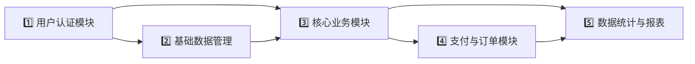

# 苍穹外卖系统开发指南

 从零开始构建整套外卖系统，理解每个技术决策的背后逻辑

---

## 📍 第一部分：战略路线图（开发顺序）


### 📋 推荐开发顺序



#### 1️⃣ 用户认证模块（最先完成）
**为什么从这里开始？**
- 所有业务模块都需要知道"当前用户是谁"
- 是整个系统的安全基础
- 后续开发调试都需要登录

**包含功能**：
- 员工登录/登出（后台管理）
- 微信用户登录（小程序端）
- JWT令牌生成和验证
- 拦截器配置

#### 2️⃣ 基础数据管理（分类和商品）
**为什么第二步？**
- 订单下单前必须有商品数据
- 菜品和分类是展示的基础
- 相对简单，适合练手

**包含功能**：
- 分类管理（增删改查）
- 菜品管理（含图片上传）
- 套餐管理
- 口味管理

#### 3️⃣ 核心业务模块（购物车与地址）
**为什么现在做？**
- 依赖商品数据
- 是下单的前置条件
- 逻辑相对独立

**包含功能**：
- 购物车管理
- 地址簿管理
- 用户信息管理

#### 4️⃣ 支付与订单模块（核心业务）
**为什么是第四步？**
- 这是系统的核心，依赖前面所有模块
- 涉及事务处理，最复杂
- 需要和外部服务（微信支付）集成

**包含功能**：
- 订单提交
- 支付处理
- 订单状态管理
- 历史订单查询

#### 5️⃣ 数据统计与报表（最后完善）
**为什么最后做？**
- 需要有足够的业务数据才有意义
- 通常不是核心流程的一部分
- 运营需求，可以后期迭代

**包含功能**：
- 营业额统计
- 订单统计
- 用户统计
- 热门商品统计

---

## 📍 第二部分：手把手实现指南

### 🌟 Phase 1: 项目初始化

#### 步骤1: 创建Maven多模块项目

**💭 思考过程**：为什么用多模块？
- 更好的代码组织（公共代码、实体类、业务逻辑分离）
- 便于团队协作
- 支持独立构建和部署

```xml
<!-- sky-parent/pom.xml -->
<modules>
    <module>sky-common</module>    <!-- 公共模块 -->
    <module>sky-pojo</module>      <!-- 实体类模块 -->
    <module>sky-server</module>    <!-- 主业务模块 -->
</modules>
```

#### 步骤2: 配置核心依赖

**💭 思考过程**：版本选择的原则
- Spring Boot 2.x最稳定，企业级首选
- MyBatis比JPA更适合复杂查询
- Druid连接池性能最好

```xml
<!-- 关键依赖版本 -->
<properties>
    <spring-boot.version>2.7.3</spring-boot.version>
    <mybatis.spring.version>2.2.0</mybatis.spring.version>
    <druid.version>1.2.1</druid.version>
    <jwt.version>0.9.1</jwt.version>
</properties>
```

#### 步骤3: 数据库设计

**💭 思考过程**：先设计数据库的原因
- 业务逻辑最终都要持久化
- 实体类基于数据库表设计
- 避免后期频繁修改表结构

**核心表设计原则**：
- 每个实体一张表
- 用ID关联，不用业务字段关联
- 添加公共字段（创建时间、更新时间）

```sql
-- 示例：用户表设计
CREATE TABLE user (
    id BIGINT PRIMARY KEY AUTO_INCREMENT,
    openid VARCHAR(45) UNIQUE NOT NULL,  -- 微信唯一标识
    name VARCHAR(32),                     -- 用户名
    phone VARCHAR(11),                    -- 手机号
    sex VARCHAR(2),                       -- 性别
    id_number VARCHAR(18),                -- 身份证号
    avatar VARCHAR(500),                  -- 头像URL
    create_time DATETIME,                 -- 创建时间
    update_time DATETIME                  -- 更新时间
);
```

### 🌟 Phase 2: 用户认证模块

#### 步骤1: 实现JWT工具类

**💭 解释JWT原理（ELI5）**：
想象JWT是一个**带加密的特殊门票**：
- 你买票时，售票处（服务器）在里面写了你的信息
- 任何人都能看到门票上的基本信息（载荷）
- 但只有售票处能验证门票的真伪（签名）
- 凭这张门票，你可以进入所有场馆（访问接口）

```java
// JwtUtil.java - 核心工具类
public class JwtUtil {
    /**
     * 生成JWT令牌
     * 就像给你的门票盖章，证明它是真的
     */
    public static String createJWT(String secretKey, long ttlMillis, String claimKey, Object claimValue) {
        // 1. 设置签名算法（HS256最常用）
        SignatureAlgorithm signatureAlgorithm = SignatureAlgorithm.HS256;

        // 2. 计算过期时间（现在是2小时）
        long expMillis = System.currentTimeMillis() + ttlMillis;

        // 3. 创建JWT构建器
        JwtBuilder builder = Jwts.builder()
            .setHeaderParam("typ", "JWT")  // 门票类型声明
            .signWith(signatureAlgorithm, secretKey.getBytes());  // 签名

        // 4. 写入用户信息（比如写上用户ID）
        builder.claim(claimKey, claimValue);
        builder.setExpiration(new Date(expMillis));

        // 5. 生成最终的JWT字符串
        return builder.compact();
    }
}
```

#### 步骤2: 实现登录Controller

**💭 思考过程**：登录流程的设计
- Controller只负责接收请求和返回响应
- 具体业务逻辑交给Service
- 使用DTO接收参数，避免直接暴露Entity

```java
// EmployeeController.java
@RestController
@RequestMapping("/admin/employee")
public class EmployeeController {

    @PostMapping("/login")
    public Result<EmployeeLoginVO> login(@RequestBody EmployeeLoginDTO employeeLoginDTO) {
        // 1. 记录日志（方便排查问题）
        log.info("员工登录：{}", employeeLoginDTO.getUsername());

        // 2. 调用Service处理业务
        Employee employee = employeeService.login(employeeLoginDTO);

        // 3. 生成JWT令牌（给用户门票）
        Map<String, Object> claims = new HashMap<>();
        claims.put(JwtClaimsConstant.EMP_ID, employee.getId());
        String token = JwtUtil.createJWT(
            jwtProperties.getAdminSecretKey(),
            jwtProperties.getAdminTtl(),
            claims
        );

        // 4. 封装返回结果
        EmployeeLoginVO employeeLoginVO = EmployeeLoginVO.builder()
            .id(employee.getId())
            .userName(employee.getUsername())
            .name(employee.getName())
            .token(token)
            .build();

        return Result.success(employeeLoginVO);
    }
}
```

#### 步骤3: 配置拦截器

**💭 解释拦截器原理（ELI5）**：
拦截器就像是**小区的保安**：
- 每个人进小区都要刷门禁卡
- 保安检查卡是否有效
- 有卡才能进，没卡请出门
- 但去保安室（登录）不需要卡

```java
// JwtTokenAdminInterceptor.java
@Component
public class JwtTokenAdminInterceptor implements HandlerInterceptor {

    @Override
    public boolean preHandle(HttpServletRequest request, HttpServletResponse response, Object handler) throws Exception {
        // 1. 检查是不是登录请求（保安室不用门禁）
        if (!(handler instanceof HandlerMethod)) {
            return true;
        }

        // 2. 从请求头中获取token（找门禁卡）
        String token = request.getHeader(jwtProperties.getAdminTokenName());

        // 3. 验证token（保安查卡）
        try {
            log.info("jwt校验:{}", token);
            Claims claims = JwtUtil.parseJWT(jwtProperties.getAdminSecretKey(), token);
            Long empId = Long.valueOf(claims.get(JwtClaimsConstant.EMP_ID).toString()));

            // 4. 存入ThreadLocal（让后续代码知道你是谁）
            BaseContext.setId(empId);
            log.info("当前员工id：", empId);
            return true;  // 放行
        } catch (JWTVerificationException e) {
            // 5. token无效，返回401
            response.setStatus(401);
            return false;
        }
    }
}
```

### 🌟 Phase 3: 商品管理模块

#### 步骤1: 设计实体类和DTO

**💭 思考过程**：为什么需要DTO？
- Entity是数据库映射，不应该直接暴露给前端
- DTO可以灵活控制返回字段
- 避免安全风险（如不返回密码）

```java
// Dish.java - 实体类（对应数据库表）
@Data
@TableName("dish")
public class Dish implements Serializable {
    private Long id;                   // 主键
    private String name;               // 菜品名称
    private Long categoryId;           // 分类ID
    private String price;              // 价格（用字符串避免精度问题）
    private String image;              // 图片路径
    private String description;        // 描述
    private Integer status;            // 状态：0停售 1起售
    private Integer updateTime;        // 更新时间
    private Integer createTime;        // 创建时间
    private Long createUser;           // 创建人
    private Long updateUser;           // 更新人
}

// DishDTO.java - 数据传输对象
@Data
public class DishDTO implements Serializable {
    private Long id;                   // 新增时为空
    private String name;               // 菜品名称
    private Long categoryId;           // 分类ID
    private String price;              // 价格
    private String image;              // 图片
    private String description;        // 描述
    private Integer status;            // 状态
    private List<DishFlavor> flavors;  // 口味列表（比Entity多）
}
```

#### 步骤2: 实现Service的事务管理

**💭 解释事务原理（ELI5）**：
就像**银行转账**：
- A转钱给B，涉及两个操作：A扣钱、B加钱
- 如果第一个成功了，第二个失败了，钱就消失了
- 事务确保：要么都成功，要么都失败

```java
// DishServiceImpl.java
@Service
public class DishServiceImpl implements DishService {

    @Override
    @Transactional  // 开启事务
    @AutoFill(value = OperationType.INSERT)  // 自动填充创建信息
    public void saveWithFlavors(DishDTO dishDTO) {
        // 1. 保存菜品基本信息
        Dish dish = new Dish();
        BeanUtils.copyProperties(dishDTO, dish);
        dishMapper.insert(dish);

        // 2. 获取菜品ID
        Long dishId = dish.getId();

        // 3. 保存口味信息
        List<DishFlavor> flavors = dishDTO.getFlavors();
        if (flavors != null && flavors.size() > 0) {
            flavors.forEach(flavor -> flavor.setDishId(dishId));
            dishFlavorMapper.insertBatch(flavors);
        }
    }

    @Override
    @Transactional  // 删除也要用事务
    public void deleteBatch(List<Long> ids) {
        // 1. 判断菜品是否在售卖中
        for (Long id : ids) {
            Dish dish = dishMapper.selectById(id);
            if (dish.getStatus() == StatusConstant.ENABLE) {
                throw new DeletionNotAllowedException("菜品在售卖中，不能删除");
            }
        }

        // 2. 删除菜品
        dishMapper.deleteBatch(ids);

        // 3. 删除关联口味
        dishFlavorMapper.deleteBatch(ids);
    }
}
```

#### 步骤3: 文件上传（OSS集成）

**💭 解释OSS存储原理**：
传统的做法：文件存在服务器上
- 服务器挂了，文件也挂了
- 扩容麻烦，上传速度慢

OSS存储：文件存在云上
- 专业团队维护，99.99%可用性
- 全球加速，上传速度快
- 按使用付费，更经济

```java
// CommonController.java
@RestController
@RequestMapping("/admin/common")
public class CommonController {

    @PostMapping("/upload")
    public Result<String> upload(MultipartFile file) {
        log.info("文件上传：{}", file.getOriginalFilename());

        try {
            // 1. 获取原始文件名
            String originalFilename = file.getOriginalFilename();
            String extension = originalFilename.substring(originalFilename.lastIndexOf("."));

            // 2. 生成新文件名（防止重复）
            String objectName = UUID.randomUUID().toString() + extension;

            // 3. 调用OSS上传
            String filePath = aliOSSUtil.upload(file.getBytes(), objectName);

            return Result.success(filePath);
        } catch (IOException e) {
            log.error("文件上传失败：", e);
            return Result.error(MessageConstant.UPLOAD_FAILED);
        }
    }
}
```

### 🌟 Phase 4: 订单模块

#### 步骤1: 设计订单状态机

**💭 解释状态机概念**：
订单状态就像**快递物流**：
- 已下单 → 已付款 → 派送中 → 已完成
- 不能从"已下单"直接跳到"已完成"
- 每个状态都有明确的下一步

```java
// Orders.java - 订单实体
public class Orders {
    // 状态常量
    public static final Integer PENDING_PAYMENT = 1;   // 待付款
    public static final Integer PAID = 2;             // 已付款
    public static final Integer DELIVERING = 3;       // 派送中
    public static final Integer COMPLETED = 4;        // 已完成
    public static final Integer CANCELLED = 5;        // 已取消

    private Integer status;  // 订单状态
}

// OrderService.java - 订单状态流转
public void confirm(OrderStatusDTO orderStatusDTO) {
    // 1. 查询订单当前状态
    Orders order = orderMapper.selectById(orderStatusDTO.getId());

    // 2. 检查状态流转是否合法
    if (!order.getStatus().equals(Orders.PAID)) {
        throw new OrderBusinessException("订单状态错误");
    }

    // 3. 更新到下一个状态
    order.setStatus(Orders.DELIVERING);
    order.setUpdateTime(LocalDateTime.now());
    orderMapper.update(order);
}
```

#### 步骤2: 处理高并发下单

**💭 解释并发问题**：
想象秒杀场景：
- 库存只剩1件
- 100个人同时下单
- 如果不加控制，100个人都成功
- 实际库存变成-99（超卖）

```java
// OrderServiceImpl.java
@Override
@Transactional
public OrderSubmitVO submitOrder(OrdersSubmitDTO ordersSubmitDTO) {
    // 1. 获取当前用户ID
    Long userId = BaseContext.getCurrentId();

    // 2. 查询购物车数据（用锁避免并发问题）
    // Redis锁的简单实现
    String lockKey = "order:lock:" + userId;
    try {
        boolean locked = redisTemplate.opsForValue().setIfAbsent(lockKey, "1", 10, TimeUnit.SECONDS);
        if (!locked) {
            throw new OrderBusinessException("下单过于频繁，请稍后再试");
        }

        // 3. 查询地址（事务内）
        AddressBook addressBook = addressBookMapper.selectById(ordersSubmitDTO.getAddressBookId());

        // 4. 查询购物车
        List<ShoppingCart> shoppingCartList = shoppingCartMapper.selectByUserId(userId);
        if (shoppingCartList.isEmpty()) {
            throw new ShoppingCartBusinessException("购物车为空，不能下单");
        }

        // 5. 向订单表插入数据（1条）
        Orders order = new Orders();
        BeanUtils.copyProperties(ordersSubmitDTO, order);
        order.setUserId(userId);
        order.setOrderTime(LocalDateTime.now());
        order.setPayMethod(ordersSubmitDTO.getPayMethod());
        order.setStatus(Orders.PENDING_PAYMENT);
        order.setNumber(String.valueOf(System.currentTimeMillis()));
        order.setPhone(addressBook.getPhone());
        order.setAddress(addressBook.getDetail());
        order.setConsignee(addressBook.getConsignee());

        orderMapper.insert(order);

        // 6. 向订单明细表插入数据（多条）
        List<OrderDetail> orderDetailList = new ArrayList<>();
        for (ShoppingCart cart : shoppingCartList) {
            OrderDetail orderDetail = new OrderDetail();
            BeanUtils.copyProperties(cart, orderDetail);
            orderDetail.setOrderId(order.getId());
            orderDetailList.add(orderDetail);
        }
        orderDetailMapper.insertBatch(orderDetailList);

        // 7. 清空购物车
        shoppingCartMapper.deleteByUserId(userId);

        // 8. 封装返回结果
        OrderSubmitVO orderSubmitVO = OrderSubmitVO.builder()
            .id(order.getId())
            .orderNumber(order.getNumber())
            .orderAmount(order.getAmount())
            .build();

        return orderSubmitVO;

    } finally {
        // 9. 释放锁
        redisTemplate.delete(lockKey);
    }
}
```

---

## 📍 第三部分：核心概念深入理解

### 🔑 概念一：AOP切面编程

**💡 ELI5解释**：
想象写代码就像写文章。正常情况下，每个方法只写自己的业务逻辑。但如果我们需要在每个方法前都记录日志呢？

*不使用AOP*：每个方法都写一遍日志代码
*使用AOP*：像在字里行间贴**透明胶带**，胶带上可以记录日志，但不改变原文内容

```java
// 定义注解（透明胶带）
@Target(ElementType.METHOD)
@Retention(RetentionPolicy.RUNTIME)
public @interface AutoFill {
    OperationType value();  // 操作类型
}

// 定义切面（胶带的实现）
@Aspect
@Component
public class AutoFillAspect {

    @Pointcut("@annotation(com.sky.annotation.AutoFill)")
    public void autoFillPointCut() {}

    @Before("autoFillPointCut()")
    public void autoFill(JoinPoint joinPoint) {
        // 1. 获取当前被拦截的方法上的数据库操作类型
        MethodSignature signature = (MethodSignature) joinPoint.getSignature();
        AutoFill autoFill = signature.getMethod().getAnnotation(AutoFill.class);
        OperationType operationType = autoFill.value();

        // 2. 获取当前方法的参数
        Object[] args = joinPoint.getArgs();
        if (args == null || args.length == 0) {
            return;
        }

        Object entity = args[0];

        // 3. 准备需要赋值的数据
        LocalDateTime now = LocalDateTime.now();
        Long currentId = BaseContext.getCurrentId();

        // 4. 根据不同的操作类型，通过反射赋值
        if (operationType == OperationType.INSERT) {
            try {
                Method setCreateTime = entity.getClass().getDeclaredMethod("setCreateTime", LocalDateTime.class);
                Method setCreateUser = entity.getClass().getDeclaredMethod("setCreateUser", Long.class);

                setCreateTime.invoke(entity, now);
                setCreateUser.invoke(entity, currentId);
            } catch (Exception e) {
                e.printStackTrace();
            }
        }
    }
}

// 使用切面（贴胶带）
@PostMapping
@AutoFill(value = OperationType.INSERT)
public Result save(@RequestBody CategoryDTO categoryDTO) {
    categoryService.save(categoryDTO);
    return Result.success();
}
```

### 🔑 概念二：ThreadLocal原理

**💡 ELI5解释**：
想象每个ThreadLocal变量都是一个**私人储物柜**：
- 每个线程进来都能用自己的柜子
- 柜子是隔离的，A线程看不到B线程的内容
- 适合存储线程私有的数据（如用户ID）

```java
// BaseContext.java - 线程上下文工具类
public class BaseContext {
    public static ThreadLocal<Long> threadLocal = new ThreadLocal<>();

    public static void setCurrentId(Long id) {
        threadLocal.set(id);  // 放入储物柜
    }

    public static Long getCurrentId() {
        return threadLocal.get();  // 从储物柜取
    }

    public static void removeCurrentId() {
        threadLocal.remove();  // 清空储物柜（防止内存泄漏）
    }
}

// 在拦截器中使用
public boolean preHandle(...) {
    // 验证JWT后，把用户ID存入ThreadLocal
    Long empId = 获取到的用户ID;
    BaseContext.setCurrentId(empId);
    return true;
}

// 在任何地方使用，都不用传参
public OrderVO orderDetails(Long id) {
    // 直接从ThreadLocal获取当前用户ID
    Long userId = BaseContext.getCurrentId();
    // ...业务逻辑
}
```

### 🔑 概念三：统一异常处理

**💡 ELI5解释**：
就像公司的**前台接待**：
- 任何部门（Controller）遇到问题
- 都把问题报告给前台（全局异常处理器）
- 前台统一处理：记录日志、整理话术、回复用户
- 这样每个部门都不用自己处理异常

```java
// GlobalExceptionHandler.java
@RestControllerAdvice
public class GlobalExceptionHandler {

    // 1. 处理业务异常
    @ExceptionHandler
    public Result exceptionHandler(BaseException ex) {
        log.error("异常信息：{}", ex.getMessage());
        return Result.error(ex.getMessage());
    }

    // 2. 处理SQL异常（如唯一键冲突）
    @ExceptionHandler
    public Result exceptionHandler(SQLIntegrityConstraintViolationException ex) {
        String message = ex.getMessage();
        if (message.contains("Duplicate entry")) {
            String[] split = message.split(" ");
            String username = split[2];
            return Result.error(username + MessageConstant.ALREADY_EXISTS);
        } else {
            return Result.error(MessageConstant.UNKNOWN_ERROR);
        }
    }

    // 3. 处理参数绑定异常
    @ExceptionHandler(MethodArgumentNotValidException.class)
    public Result exceptionHandler(MethodArgumentNotValidException ex) {
        // 获取第一个错误信息
        String message = ex.getBindingResult().getAllErrors().get(0).getDefaultMessage();
        return Result.error(message);
    }
}
```

---

## 📍 第四部分：改进建议与总结

### 🚀 改进建议

#### 1. 性能优化：引入缓存层

**当前问题**：
- 商品列表每次都查数据库
- 热门商品查询压力大

**改进方案**：
```java
// 使用Redis缓存
public List<DishVO> listWithFlavor(DishDTO dishDTO) {
    // 1. 先查Redis缓存
    String cacheKey = "dish:list:" + dishDTO.getCategoryId();
    List<DishVO> cacheList = redisTemplate.opsForValue().get(cacheKey);

    if (cacheList != null) {
        return cacheList;  // 命中缓存，直接返回
    }

    // 2. 查数据库
    List<DishVO> dishVOList = dishMapper.selectWithFlavor(dishDTO);

    // 3. 写入Redis，设置过期时间30分钟
    redisTemplate.opsForValue().set(cacheKey, dishVOList, 30, TimeUnit.MINUTES);

    return dishVOList;
}
```

#### 2. 安全增强：API限流

**当前问题**：
- 恶意用户可能频繁调用接口
- 秒杀场景容易被攻击

**改进方案**：
```java
// 使用Redis实现简单限流
@Component
public class RateLimiterAspect {

    @Autowired
    private RedisTemplate redisTemplate;

    @Around("@annotation(rateLimiter)")
    public Object around(ProceedingJoinPoint joinPoint, RateLimiter rateLimiter) throws Throwable {
        // 获取方法名作为key
        String key = "limit:" + joinPoint.getSignature().toShortString();

        // 滑动窗口实现
        Long count = redisTemplate.opsForValue().increment(key, 1);
        if (count == 1) {
            redisTemplate.expire(key, 1, TimeUnit.SECONDS);
        }

        // 判断是否超过限制
        if (count > rateLimiter.count()) {
            throw new RequestLimitException("请求过于频繁，请稍后再试");
        }

        return joinPoint.proceed();
    }
}
```

#### 3. 代码重构：引入领域驱动设计

**当前问题**：
- Service层过于臃肿
- 业务逻辑散乱

**改进方案**：
```java
// 引入领域模型
public class OrderDomain {
    private Orders order;
    private List<OrderDetail> orderDetails;

    // 核心业务逻辑封装在领域模型中
    public void calculateAmount() {
        BigDecimal total = BigDecimal.ZERO;
        for (OrderDetail detail : orderDetails) {
            total = total.add(detail.getAmount());
        }
        order.setAmount(total);
    }

    public void cancel() {
        // 判断是否可以取消
        if (order.getStatus() > Orders.PAID) {
            throw new OrderBusinessException("订单已接单，无法取消");
        }
        order.setStatus(Orders.CANCELLED);
    }
}

// Service层变薄
public class OrderService {
    public void cancel(Long orderId) {
        // 1. 加载订单领域对象
        OrderDomain orderDomain = orderRepository.load(orderId);

        // 2. 执行业务逻辑
        orderDomain.cancel();

        // 3. 保存
        orderRepository.save(orderDomain);
    }
}
```

### 📝 项目架构总结

这个项目之所以架构良好，是因为：

1. **清晰的分层结构**
   - 各层职责明确，高内聚低耦合
   - 便于测试和维护

2. **合理的技术选型**
   - Spring Boot简化开发
   - MyBatis灵活控制SQL
   - Redis提升性能

3. **完善的异常处理**
   - 统一异常处理机制
   - 优雅的错误响应

4. **良好的扩展性**
   - 可轻松添加新模块
   - 支持水平扩展

5. **安全性考虑**
   - JWT令牌验证
   - 参数校验
   - SQL注入防护


