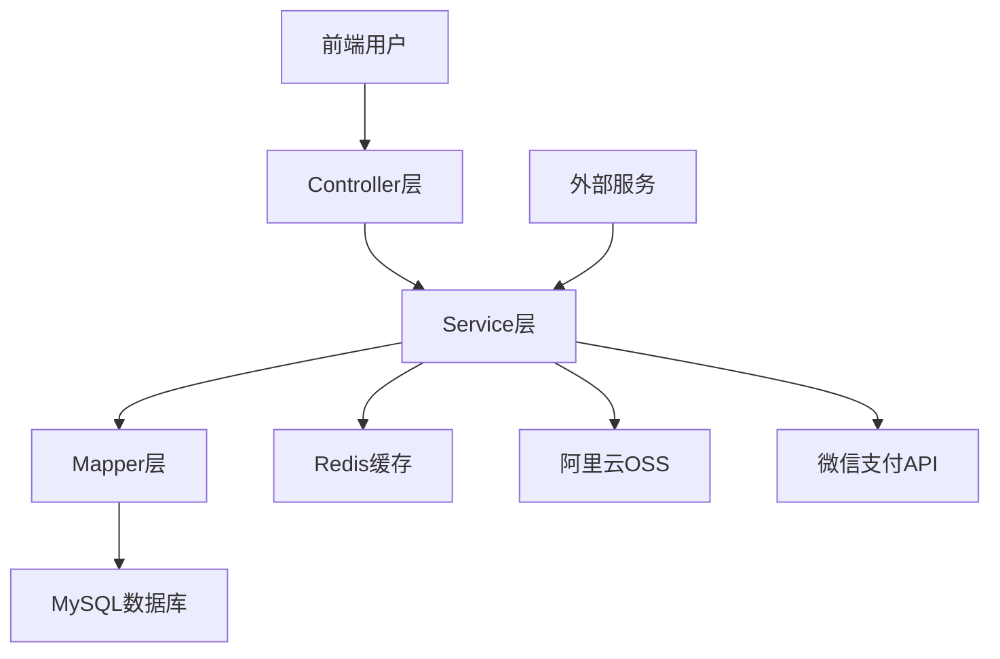
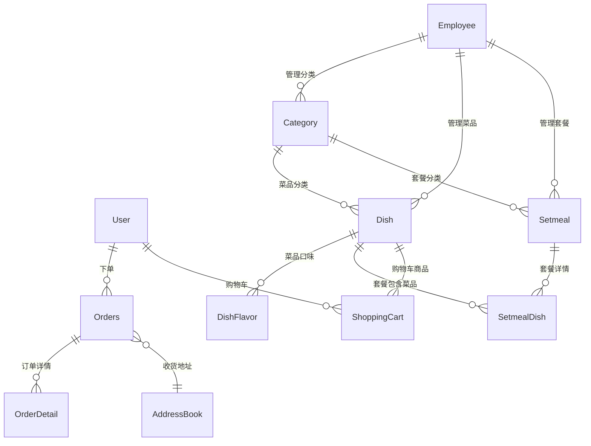
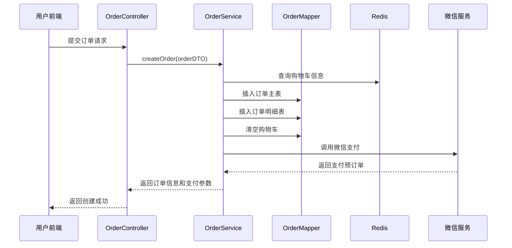
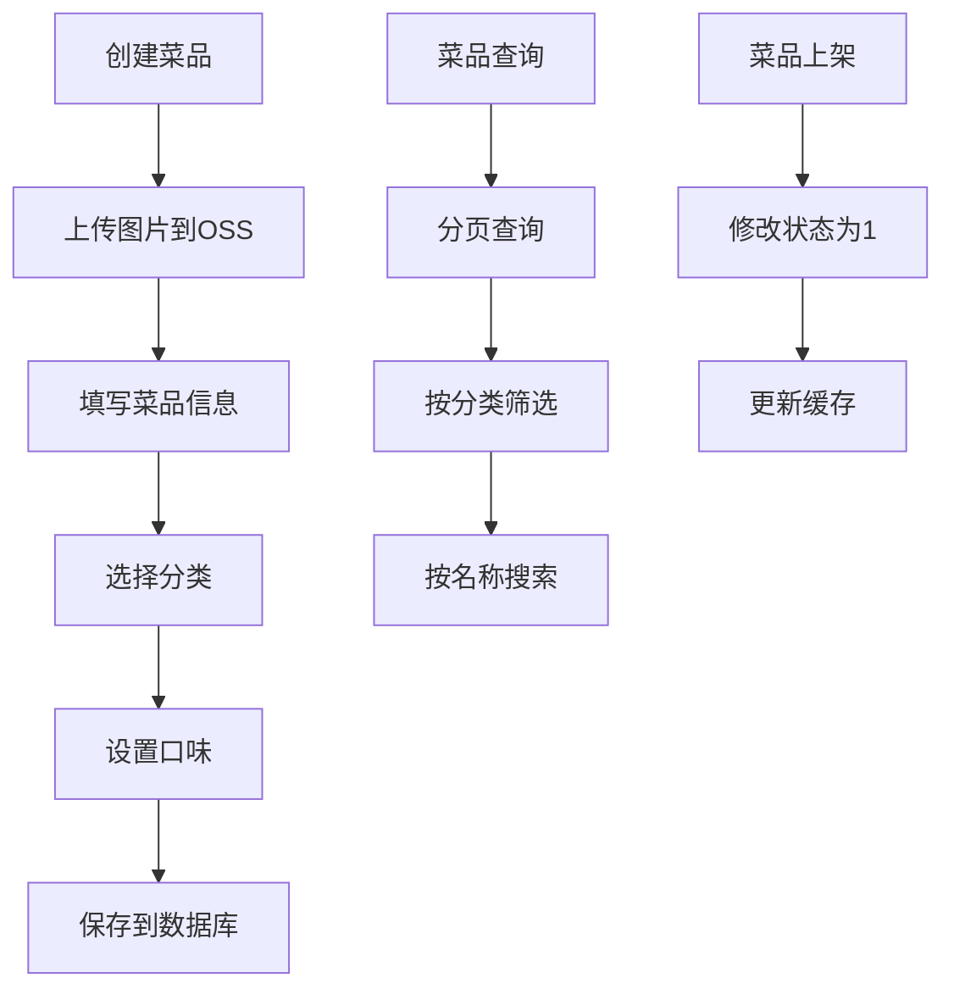
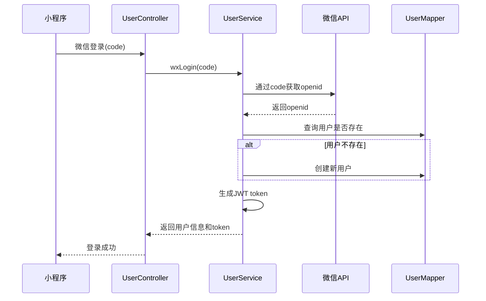

# Sky Take-Out外卖系统 - 项目重建与分析文档

## 1. 项目初始化与技术栈分析

### 1.1 项目基本信息
- **项目名称**: sky-take-out (苍穹外卖)
- **项目类型**: Spring Boot 微服务项目
- **构建工具**: Maven (多模块项目)
- **Java版本**: 隐含使用 Java 11+ (Spring Boot 2.7.3)

### 1.2 核心技术栈与版本

| 技术组件 | 版本 | 用途说明 |
|---------|------|---------|
| Spring Boot | 2.7.3 | 核心框架，提供自动配置和快速开发能力 |
| MyBatis | 2.2.0 | ORM框架，用于数据持久化操作 |
| MySQL Driver | 8.x | 数据库连接驱动 |
| Redis | - | 缓存和会话存储 |
| Druid | 1.2.1 | 高性能数据库连接池 |
| PageHelper | 1.3.0 | MyBatis分页插件 |
| Lombok | 1.18.20 | 代码简化工具（自动生成getter/setter） |
| Fastjson | 1.2.76 | JSON序列化/反序列化 |
| Knife4j | 3.0.2 | API文档工具（Swagger增强版） |
| JJWT | 0.9.1 | JWT令牌生成和验证 |
| Aliyun OSS | 3.10.2 | 阿里云对象存储服务（文件上传） |
| Apache POI | 3.16 | Excel文件处理（报表导出） |
| 微信支付SDK | 0.4.8 | 微信支付集成 |

### 1.3 技术选择解析

**为什么选择Spring Boot 2.7.3？**
- 企业级稳定性：2.7.x是长期支持版本，成熟稳定
- 完善的生态系统：与各种中间件兼容性好
- 简化配置：自动配置减少了XML配置的复杂度

**为什么使用MyBatis而非JPA？**
- SQL灵活性：外卖系统需要复杂的查询和统计，MyBatis提供更好的SQL控制
- 性能优化：能够精细控制SQL执行
- 学习曲线：对于传统Java开发者更友好

**数据库选择MySQL的原因：**
- 开源免费，降低项目成本
- 性能优秀，适合外卖系统的并发场景
- 社区支持完善，问题解决资源丰富

## 2. 架构设计与数据库设计

### 2.1 项目模块结构

```
sky-take-out/
├── sky-common/      # 公共模块（工具类、常量、通用配置）
├── sky-pojo/        # 数据对象模块（Entity、DTO、VO）
└── sky-server/      # 主业务模块（Controller、Service、Mapper）
```

### 2.2 架构模式：分层架构



### 2.3 数据库设计与实体关系



### 2.4 核心实体关系解析

**一对多关系（1:N）**
- **User → Orders**: 一个用户可以有多个订单
- **Category → Dish**: 一个分类下可以有多个菜品
- **Orders → OrderDetail**: 一个订单包含多个订单明细
- **User → ShoppingCart**: 一个用户有多个购物车项

**多对多关系（M:N）**
- **Dish ↔ Setmeal**: 通过SetmealDish中间表实现，菜品和套餐的多对多关系

**核心数据模型说明**

1. **User（用户表）**: 使用微信openid作为唯一标识，支持微信登录
2. **Employee（员工表）**: 后台管理员账户，用于系统管理
3. **Orders（订单表）**: 订单主表，包含订单状态流转（待付款→待接单→已接单→派送中→已完成）
4. **Dish（菜品表）**: 商品的菜品信息，关联分类
5. **Category（分类表）**: 支持菜品分类和套餐分类两种类型

## 3. 核心业务模块实现流程

### 3.1 模块一：用户订单模块（Order）

#### 数据流程图


#### 实现步骤详解

**第一步：定义实体类和DTO**
```java
// sky-pojo模块
@Entity
@Table(name = "orders")
public class Orders {
    // 订单基础信息
    private Long id;
    private String number;        // 订单号
    private Integer status;       // 订单状态
    private Long userId;          // 用户ID
    // ...其他字段
}

// 数据传输对象
public class OrdersSubmitDTO {
    private Long addressBookId;   // 地址簿ID
    private Integer payMethod;    // 支付方式
    private String remark;        // 备注
    private List<ShoppingCartDTO> shoppingCart;
}
```

**第二步：创建Mapper接口和XML**
```java
// OrderMapper.java
@Mapper
public interface OrderMapper {
    void insert(Orders orders);
    void insertBatch(List<OrderDetail> orderDetails);
    PageResult pageQuery(OrderPageQueryDTO orderPageQueryDTO);
}

// OrderMapper.xml - 定义SQL映射
<insert id="insert" useGeneratedKeys="true" keyProperty="id">
    INSERT INTO orders (number, user_id, address_book_id, ...)
    VALUES (#{number}, #{userId}, #{addressBookId}, ...)
</insert>
```

**第三步：实现Service业务逻辑**
```java
@Service
public class OrderServiceImpl implements OrderService {
    @Autowired
    private OrderMapper orderMapper;

    @Autowired
    private ShoppingCartMapper shoppingCartMapper;

    @Override
    @Transactional
    public OrderSubmitVO submitOrder(OrdersSubmitDTO ordersSubmitDTO) {
        // 1. 处理业务逻辑
        // 2. 向OrderMapper插入数据
        // 3. 向OrderDetailMapper插入数据
        // 4. 清空购物车
        // 5. 封装返回结果
    }
}
```

**第四步：暴露Controller接口**
```java
@RestController
@RequestMapping("/user/order")
public class OrderController {
    @Autowired
    private OrderService orderService;

    @PostMapping("/submit")
    public Result<OrderSubmitVO> submit(@RequestBody OrdersSubmitDTO ordersSubmitDTO) {
        OrderSubmitVO orderSubmitVO = orderService.submitOrder(ordersSubmitDTO);
        return Result.success(orderSubmitVO);
    }
}
```

### 3.2 模块二：菜品管理模块（Dish）

#### 核心功能流程


#### 数据流转路径

1. **Controller层** (`DishController`)
   - 接收HTTP请求（POST/GET/PUT/DELETE）
   - 参数验证（使用DTO接收参数）
   - 调用Service层处理业务

2. **Service层** (`DishServiceImpl`)
   - 业务逻辑处理
   - 事务管理（@Transactional）
   - 调用多个Mapper完成复杂操作

3. **Mapper层** (`DishMapper`)
   - 数据库操作
   - SQL映射（MyBatis）
   - 返回Entity对象

### 3.3 模块三：用户模块（User）

#### 微信登录流程


## 4. 配置与环境说明

### 4.1 核心配置文件（application.yml）

```yaml
# 服务器配置
server:
  port: 8080

# 数据源配置
spring:
  datasource:
    druid:
      driver-class-name: com.mysql.cj.jdbc.Driver
      url: jdbc:mysql://localhost:3306/sky_take_out
      username: root
      password: 123456

# Redis配置
  redis:
    host: localhost
    port: 6379
    password: 123456
    database: 0

# MyBatis配置
mybatis:
  mapper-locations: classpath:mapper/*.xml
  type-aliases-package: com.sky.entity
  configuration:
    map-underscore-to-camel-case: true

# 自定义配置
sky:
  jwt:
    # 管理端JWT配置
    admin-secret-key: itcast
    admin-ttl: 7200000
    admin-token-name: token

    # 用户端JWT配置
    user-secret-key: itheima
    user-ttl: 7200000
    user-token-name: authentication

  # 阿里云OSS配置
  alioss:
    endpoint: oss-cn-guangzhou.aliyuncs.com
    access-key-id: YOUR_ACCESS_KEY
    access-key-secret: YOUR_SECRET_KEY
    bucket-name: chi-fan-bao

  # 微信支付配置
  wechat:
    appid: YOUR_APPID
    secret: YOUR_SECRET
    mchid: YOUR_MCHID
    # ...其他微信支付参数
```

### 4.2 关键配置类说明

1. **WebMvcConfiguration**
   - 配置拦截器（JWT验证）
   - 配置跨域处理
   - 配置文件上传解析器

2. **RedisConfiguration**
   - 配置Redis连接工厂
   - 配置RedisTemplate序列化方式

3. **OssConfiguration**
   - 配置阿里云OSS客户端
   - 用于文件上传功能

### 4.3 项目启动流程

1. **环境准备**
   ```bash
   # 安装依赖软件
   - JDK 11+
   - MySQL 8.0
   - Redis 6.0
   - Maven 3.6+
   ```

2. **数据库初始化**
   ```sql
   CREATE DATABASE sky_take_out;
   -- 执行SQL脚本创建表结构（需从其他位置获取）
   ```

3. **配置修改**
   ```yaml
   # 修改application-dev.yml中的配置
   sky:
     datasource:
       password: 你的MySQL密码
     redis:
       password: 你的Redis密码
   ```

4. **启动项目**
   ```bash
   mvn clean install
   cd sky-server
   mvn spring-boot:run
   ```

### 4.4 API访问地址

- **管理端API文档**: http://localhost:8080/doc.html#/admin
- **用户端API文档**: http://localhost:8080/doc.html#/user
- **后台管理页面**: http://localhost:8080/backend/index.html

## 5. 项目特色与亮点

### 5.1 技术亮点

1. **双重JWT验证**
   - 管理端和用户端使用不同的JWT配置
   - 灵活的权限控制

2. **AOP切面编程**
   - 使用@AutoFill注解自动填充公共字段
   - 统一的日志记录

3. **WebSocket实时通信**
   - 订单状态实时推送
   - 店铺状态实时更新

4. **定时任务**
   - 处理超时未支付订单
   - 数据统计和报表生成

### 5.2 业务特色

1. **完整的订单流程**
   - 从下单到支付的完整闭环
   - 订单状态机管理

2. **灵活的商品管理**
   - 菜品和套餐的灵活组合
   - 支持多种口味选择

3. **数据报表功能**
   - 营业额统计
   - 用户统计
   - 订单统计
   - Top10热门商品

## 快速上手指南

1. **克隆项目**并导入IDE
2. **配置数据库**和Redis连接信息
3. **运行SQL脚本**初始化数据
4. **配置阿里云OSS**（如需文件上传功能）
5. **配置微信支付**（如需支付功能）
6. **启动应用**访问API文档

---
*文档生成时间: 2025-04-23*
*项目版本: sky-take-out v1.0-SNAPSHOT*